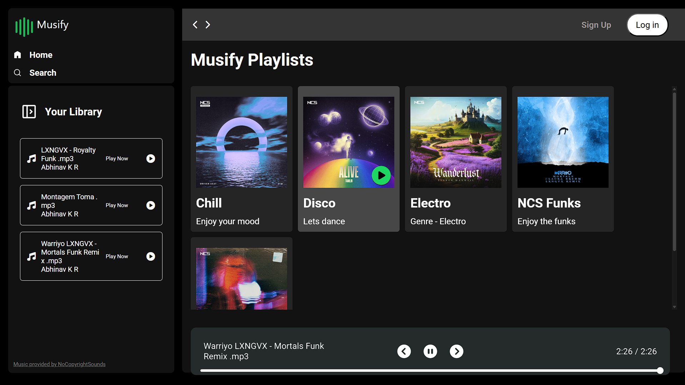
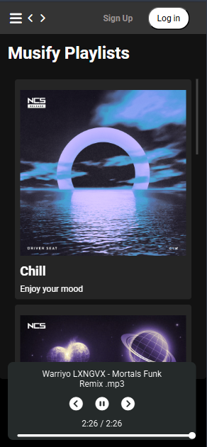
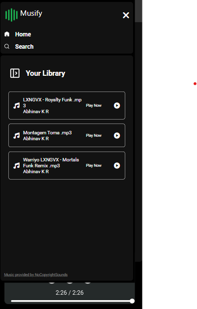

# 🎵 Musify – A Spotify-Inspired Music Streaming Web App

Musify is a sleek and responsive music player web application that mimics core features of Spotify. Built with pure HTML, CSS, and JavaScript, Musify dynamically loads songs and albums from a structured folder system and plays them directly in the browser.

---

## 📸 Screenshots

| Laptop View | Mobile View1 | Mobile View2 |
|----------|-------------|---------------|
|  |  |  |

---

## 🧠 Features

- 🎵 Dynamic album and song loading
- 📁 Album folders containing `.mp3`, `cover.jpg`, and `info.json`
- 💡 Album info (title & description) loaded dynamically
- 🎧 Audio playback with JavaScript
- 📱 Fully responsive UI for mobile and desktop
- 🔄 Automatically updates when new albums/songs are added 

---

